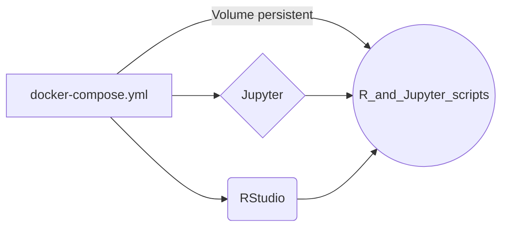

For access RStudio 

 - url: http://localhost:8787
 - usr: admin
 - pass: admin

Access Jupyter

 - url: http://localhost:8888
 - token: admin

And this will produce a flow chart:

```mermaid
graph LR
A[docker-compose.yml] -- Volume persistent --> B((R_and_Jupyter_scripts))
A --> C(RStudio)
A --> D{Jupyter}
D --> B
C --> B
```

 
